# 🚀 Peoplebox ATS - Project Documentation

## 📋 Table of Contents
1. [Project Overview](#project-overview)
2. [Architecture](#architecture)
3. [Technology Stack](#technology-stack)
4. [Project Structure](#project-structure)
5. [Database Schema](#database-schema)
6. [API Documentation](#api-documentation)
7. [Development Setup](#development-setup)
8. [Docker Configuration](#docker-configuration)
9. [Clean Architecture Implementation](#clean-architecture-implementation)
10. [Security & Authentication](#security--authentication)

---

## 🎯 Project Overview

**Peoplebox ATS** is a comprehensive Applicant Tracking System built with modern technologies following Clean Architecture principles. The system enables organizations to manage recruitment processes, track candidates, and streamline hiring workflows.

### Key Features
- 👤 User Management (Admin, Recruiter, Interviewer roles)
- 📊 Project/Job Position Management
- 👥 Candidate Tracking & Management
- 📝 Task & Assessment Management
- 💬 Question-Answer System
- 🔐 JWT-based Authentication
- 📧 Email Notifications
- 📁 File Upload Support

---

## 🏗️ Architecture

### Clean Architecture Implementation

The project follows **Clean Architecture** principles with clear separation of concerns:

```
┌─────────────────────────────────────────────────────────────┐
│                    PRESENTATION LAYER                        │
│  ┌─────────────────┐  ┌─────────────────┐  ┌─────────────────┐│
│  │   Controllers   │  │      DTOs       │  │  Interceptors   ││
│  │                 │  │                 │  │                 ││
│  │ • Auth          │  │ • CreateUser    │  │ • Response      ││
│  │ • Candidate     │  │ • CreateProject │  │ • Transform     ││
│  │ • Project       │  │ • Login         │  │                 ││
│  │ • User          │  │                 │  │                 ││
│  └─────────────────┘  └─────────────────┘  └─────────────────┘│
└─────────────────────────────────────────────────────────────┘
                              ↕
┌─────────────────────────────────────────────────────────────┐
│                   APPLICATION LAYER                         │
│  ┌─────────────────┐  ┌─────────────────┐                   │
│  │   Use Cases     │  │    Services     │                   │
│  │                 │  │                 │                   │
│  │ • AuthUseCases  │  │ • CandidateServ │                   │
│  │ • ProjectUseCases│  │ • MailService   │                   │
│  │ • UserUseCases  │  │                 │                   │
│  └─────────────────┘  └─────────────────┘                   │
└─────────────────────────────────────────────────────────────┘
                              ↕
┌─────────────────────────────────────────────────────────────┐
│                     DOMAIN LAYER                            │
│  ┌─────────────────┐  ┌─────────────────┐                   │
│  │    Entities     │  │   Interfaces    │                   │
│  │                 │  │                 │                   │
│  │ • User          │  │ • IRepository   │                   │
│  │ • Project       │  │ • IService      │                   │
│  │ • Candidate     │  │ • IAuthService  │                   │
│  │ • Task          │  │ • IMailService  │                   │
│  │ • Question      │  │                 │                   │
│  │ • Reply         │  │                 │                   │
│  └─────────────────┘  └─────────────────┘                   │
└─────────────────────────────────────────────────────────────┘
                              ↕
┌─────────────────────────────────────────────────────────────┐
│                 INFRASTRUCTURE LAYER                        │
│  ┌─────────────────┐  ┌─────────────────┐  ┌─────────────────┐│
│  │  Repositories   │  │  External Serv  │  │   Database      ││
│  │                 │  │                 │  │                 ││
│  │ • UserRepo      │  │ • AuthService   │  │ • PostgreSQL    ││
│  │ • ProjectRepo   │  │ • MailService   │  │ • TypeORM       ││
│  │ • CandidateRepo │  │ • FileService   │  │ • Redis         ││
│  └─────────────────┘  └─────────────────┘  └─────────────────┘│
└─────────────────────────────────────────────────────────────┘
```

---

## 💻 Technology Stack

### Backend (NestJS)
- **Framework**: NestJS 11.0.1
- **Runtime**: Node.js
- **Language**: TypeScript
- **Database ORM**: TypeORM 0.3.25
- **Authentication**: JWT (@nestjs/jwt)
- **Validation**: class-validator, class-transformer
- **Password Hashing**: bcryptjs
- **Testing**: Jest, Supertest

### Frontend (Next.js)
- **Framework**: Next.js 15
- **Language**: TypeScript
- **Styling**: TailwindCSS
- **App Router**: Next.js App Directory

### Database & Infrastructure
- **Database**: PostgreSQL 16
- **Cache/Queue**: Redis
- **Containerization**: Docker & Docker Compose
- **Reverse Proxy**: Nginx
- **Database Admin**: Adminer

### Development Tools
- **Linting**: ESLint
- **Formatting**: Prettier
- **API Testing**: Built-in endpoints

---

## 📁 Project Structure

```
pb-nestjs/
├── backend/                    # NestJS Backend Application
│   ├── src/
│   │   ├── application/        # APPLICATION LAYER
│   │   │   ├── services/       # Application Services
│   │   │   │   ├── candidate.service.ts
│   │   │   │   └── index.ts
│   │   │   └── use-cases/      # Business Use Cases
│   │   │       ├── auth.use-cases.ts
│   │   │       ├── project.use-cases.ts
│   │   │       ├── user.use-cases.ts
│   │   │       └── index.ts
│   │   │
│   │   ├── domain/             # DOMAIN LAYER
│   │   │   ├── entities/       # Domain Entities
│   │   │   │   ├── user.entity.ts
│   │   │   │   ├── project.entity.ts
│   │   │   │   ├── candidate.entity.ts
│   │   │   │   ├── task.entity.ts
│   │   │   │   ├── question.entity.ts
│   │   │   │   ├── reply.entity.ts
│   │   │   │   └── index.ts
│   │   │   └── interfaces/     # Domain Interfaces
│   │   │       ├── repository.interface.ts
│   │   │       └── service.interface.ts
│   │   │
│   │   ├── infrastructure/     # INFRASTRUCTURE LAYER
│   │   │   ├── database/
│   │   │   │   └── repositories/   # Data Access Layer
│   │   │   │       ├── user.repository.ts
│   │   │   │       ├── project.repository.ts
│   │   │   │       ├── candidate.repository.ts
│   │   │   │       └── index.ts
│   │   │   └── external/       # External Services
│   │   │       ├── auth.service.ts
│   │   │       ├── mail.service.ts
│   │   │       ├── file.service.ts
│   │   │       └── index.ts
│   │   │
│   │   ├── presentation/       # PRESENTATION LAYER
│   │   │   ├── controllers/    # HTTP Controllers
│   │   │   │   ├── auth.controller.ts
│   │   │   │   ├── user.controller.ts
│   │   │   │   ├── project.controller.ts
│   │   │   │   ├── candidate.controller.ts
│   │   │   │   └── index.ts
│   │   │   ├── dtos/           # Data Transfer Objects
│   │   │   │   ├── user.dto.ts
│   │   │   │   ├── project.dto.ts
│   │   │   │   ├── candidate.dto.ts
│   │   │   │   └── index.ts
│   │   │   └── interceptors/   # HTTP Interceptors
│   │   │       ├── response.interceptor.ts
│   │   │       └── index.ts
│   │   │
│   │   ├── config/            # Configuration Files
│   │   │   ├── database.config.ts
│   │   │   └── jwt.config.ts
│   │   │
│   │   ├── app.module.ts      # Main Application Module
│   │   └── main.ts           # Application Entry Point
│   │
│   ├── Dockerfile            # Backend Container Configuration
│   └── package.json         # Backend Dependencies
│
├── frontend/                 # Next.js Frontend Application
│   ├── src/
│   │   └── app/             # Next.js App Router
│   │       ├── layout.tsx   # Root Layout
│   │       ├── page.tsx     # Home Page
│   │       └── globals.css  # Global Styles
│   │
│   ├── Dockerfile           # Frontend Container Configuration
│   └── package.json        # Frontend Dependencies
│
├── nginx/                   # Reverse Proxy Configuration
│   └── nginx.conf          # Nginx Configuration
│
├── docker-compose.yaml     # Docker Services Configuration
├── .env                   # Environment Variables
└── CLAUDE.md             # Development Instructions
```

---

## 🗄️ Database Schema

### Entity Relationships

```mermaid
erDiagram
    User ||--o{ Project : "owns"
    Project ||--o{ Candidate : "has"
    Candidate ||--o{ Task : "assigned"
    Task ||--o{ Question : "contains"
    Question ||--o{ Reply : "answered"

    User {
        int id PK
        string email UK
        string password
        string firstName
        string lastName
        enum role
        boolean isActive
        timestamp createdAt
        timestamp updatedAt
    }

    Project {
        int id PK
        string title
        text description
        enum status
        string position
        text requirements
        date deadline
        int ownerId FK
        timestamp createdAt
        timestamp updatedAt
    }

    Candidate {
        int id PK
        string firstName
        string lastName
        string email UK
        string phone UK
        text resumeUrl
        enum status
        text notes
        int score
        int projectId FK
        timestamp createdAt
        timestamp updatedAt
    }

    Task {
        int id PK
        string title
        text description
        enum type
        enum status
        int estimatedDuration
        date dueDate
        string candidateId FK
        timestamp createdAt
        timestamp updatedAt
    }

    Question {
        int id PK
        string title
        text content
        enum type
        json options
        int order
        boolean isRequired
        string taskId FK
        timestamp createdAt
        timestamp updatedAt
    }

    Reply {
        int id PK
        text content
        int score
        int questionId FK
        timestamp createdAt
        timestamp updatedAt
    }
```



### Entity Details

#### **User Entity**
- **Roles**: `admin`, `recruiter`, `interviewer`
- **Features**: Authentication, role-based access, user management
- **Relationships**: One-to-many with Projects

#### **Project Entity**  
- **Status**: `active`, `paused`, `completed`
- **Features**: Job position management, deadline tracking
- **Relationships**: Belongs to User, has many Candidates

#### **Candidate Entity**
- **Status**: `applied`, `screening`, `interview`, `technical_test`, `final_review`, `accepted`, `rejected`
- **Features**: Resume management, scoring, notes, status tracking
- **Relationships**: Belongs to Project, has many Tasks

#### **Task Entity**
- **Types**: Assessment tasks, interview tasks, technical tests
- **Features**: Task management, duration tracking, due dates
- **Relationships**: Belongs to Candidate, has many Questions

#### **Question Entity**
- **Types**: `text`, `multiple_choice`, `file_upload`
- **Features**: Dynamic question creation, ordering, validation
- **Relationships**: Belongs to Task, has many Replies

#### **Reply Entity**
- **Features**: Answer storage, scoring system
- **Relationships**: Belongs to Question

---

## 🔌 API Documentation

### Base URL
- **Development**: `http://localhost:3001/api`
- **Production**: `https://your-domain.com/api`

### Response Format
All API responses follow a consistent format using `ResponseInterceptor`:

```json
{
  "success": true,
  "data": {...},
  "timestamp": "2025-07-29T07:15:59.318Z"
}
```

### Authentication Endpoints

#### **POST** `/auth/register`
Register a new user
```json
// Request
{
  "email": "user@example.com",
  "password": "password123",
  "firstName": "John",
  "lastName": "Doe"
}

// Response
{
  "success": true,
  "data": {
    "id": 1,
    "email": "user@example.com",
    "firstName": "John",
    "lastName": "Doe",
    "role": "recruiter",
    "message": "User registered successfully"
  },
  "timestamp": "2025-07-29T07:15:59.318Z"
}
```

#### **POST** `/auth/login`
Authenticate user
```json
// Request
{
  "email": "user@example.com",
  "password": "password123"
}

// Response
{
  "success": true,
  "data": {
    "token": "jwt_token_here",
    "user": {
      "id": 1,
      "email": "user@example.com",
      "firstName": "John",
      "lastName": "Doe",
      "role": "recruiter"
    }
  },
  "timestamp": "2025-07-29T07:15:59.318Z"
}
```

### Project Management Endpoints

#### **GET** `/projects`
Get all projects with relationships
```json
// Response
{
  "success": true,
  "data": [
    {
      "id": 1,
      "title": "Frontend Developer Position",
      "description": "React developer needed",
      "status": "active",
      "position": "Senior Frontend Developer",
      "requirements": "React, TypeScript, Redux",
      "deadline": "2024-12-31",
      "ownerId": 2,
      "owner": {
        "id": 2,
        "email": "recruiter@example.com",
        "firstName": "Jane",
        "lastName": "Smith",
        "role": "recruiter"
      },
      "candidates": [...]
    }
  ],
  "timestamp": "2025-07-29T07:15:59.318Z"
}
```

#### **GET** `/projects/:id`
Get project by ID

#### **POST** `/projects`
Create new project

#### **PUT** `/projects/:id`
Update project

#### **DELETE** `/projects/:id`
Delete project

#### **GET** `/projects/owner/:ownerId`
Get projects by owner

### Candidate Management Endpoints

#### **GET** `/candidates`
Get all candidates
- **Query Parameters**:
  - `projectId`: Filter by project
  - `status`: Filter by status

#### **GET** `/candidates/:id`
Get candidate by ID

#### **POST** `/candidates`
Create new candidate

### Query Parameters Support
- `/candidates?projectId=1` - Candidates for specific project
- `/candidates?status=applied` - Candidates with specific status
- `/projects/owner/2` - Projects owned by specific user

---

## 🚀 Development Setup

### Prerequisites
- Node.js 18+
- Docker & Docker Compose
- PostgreSQL 16 (if running locally)

### Environment Configuration
Create `.env` file in project root:
```env
# Database Configuration
DB_HOST=db
DB_PORT=5432
DB_USERNAME=postgres
DB_PASSWORD=postgres
DB_DATABASE=pb

# Application Configuration
NODE_ENV=development
PORT=3000
FRONTEND_URL=http://localhost:3000

# JWT Configuration
JWT_SECRET=your-super-secret-jwt-key-change-this-in-production
JWT_EXPIRES_IN=24h

# File Upload Configuration
FILE_BASE_URL=http://localhost:3001

# Redis Configuration
REDIS_HOST=redis
REDIS_PORT=6379
REDIS_PASSWORD=

# Mail Configuration
MAIL_HOST=smtp.gmail.com
MAIL_PORT=587
MAIL_USER=your-email@gmail.com
MAIL_PASS=your-app-password
```

### Development Commands

#### Backend Development
```bash
cd backend

# Install dependencies
npm install

# Development server
npm run start:dev

# Watch mode with debugging
npm run start:debug

# Build for production
npm run build

# Run tests
npm run test
npm run test:watch
npm run test:e2e
npm run test:cov

# Code quality
npm run lint
npm run format
```

#### Frontend Development
```bash
cd frontend

# Install dependencies
npm install

# Development server
npm run dev

# Build for production
npm run build

# Start production server
npm run start

# Linting
npm run lint
```

#### Docker Development
```bash
# Start all services
docker-compose up -d

# Build and start
docker-compose up --build

# View logs
docker-compose logs backend
docker-compose logs frontend

# Stop services
docker-compose down

# Reset database
docker-compose down -v
```

---

## 🐳 Docker Configuration

### Services Architecture

```yaml
services:
  # PostgreSQL Database
  db:
    image: postgres:16-alpine
    environment:
      POSTGRES_USER: ${DB_USERNAME}
      POSTGRES_PASSWORD: ${DB_PASSWORD}
      POSTGRES_DB: ${DB_DATABASE}
    ports:
      - "5432:5432"
    volumes:
      - db_data:/var/lib/postgresql/data

  # Backend API
  backend:
    build: ./backend
    ports:
      - "3001:3000"
    depends_on:
      - db
    volumes:
      - ./backend:/app
      - /app/node_modules

  # Frontend Application
  frontend:
    build: ./frontend
    ports:
      - "3000:3000"
    depends_on:
      - backend

  # Database Administration
  adminer:
    image: adminer
    ports:
      - "8081:8080"
    depends_on:
      - db

  # Reverse Proxy
  nginx:
    image: nginx:alpine
    ports:
      - "9000:80"
    volumes:
      - ./nginx/nginx.conf:/etc/nginx/conf.d/default.conf
    depends_on:
      - backend
      - frontend
```

### Access Points
- **Frontend**: http://localhost:3000
- **Backend API**: http://localhost:3001
- **Full Stack (via nginx)**: http://localhost:9000
- **Database Admin**: http://localhost:8081
- **PostgreSQL**: localhost:5432

---

## 🏛️ Clean Architecture Implementation

### Layer Responsibilities

#### **1. Presentation Layer** (`src/presentation/`)
- **Controllers**: Handle HTTP requests/responses
- **DTOs**: Data validation and transformation
- **Interceptors**: Cross-cutting concerns (logging, formatting)
- **Dependencies**: Can depend on Application layer

#### **2. Application Layer** (`src/application/`)
- **Use Cases**: Business logic orchestration
- **Services**: Application-specific services  
- **Dependencies**: Can depend on Domain layer only

#### **3. Domain Layer** (`src/domain/`)
- **Entities**: Core business objects
- **Interfaces**: Contracts for external dependencies
- **Dependencies**: No dependencies (pure business logic)

#### **4. Infrastructure Layer** (`src/infrastructure/`)
- **Repositories**: Data access implementations
- **External Services**: Third-party integrations
- **Dependencies**: Implements Domain interfaces

### Dependency Injection Pattern

```typescript
// Domain Interface
export interface ICandidateRepository {
  findAll(): Promise<Candidate[]>;
  findById(id: string): Promise<Candidate | null>;
  // ...
}

// Infrastructure Implementation  
@Injectable()
export class CandidateRepository implements ICandidateRepository {
  constructor(
    @InjectRepository(Candidate)
    private readonly repository: Repository<Candidate>,
  ) {}
  // ...
}

// Application Module Binding
providers: [
  {
    provide: 'ICandidateRepository',
    useClass: CandidateRepository,
  },
]

// Application Layer Usage
@Injectable()
export class CandidateService {
  constructor(
    @Inject('ICandidateRepository')
    private readonly candidateRepository: ICandidateRepository,
  ) {}
  // ...
}
```

### Benefits of This Architecture
1. **Testability**: Easy to mock dependencies
2. **Maintainability**: Clear separation of concerns
3. **Flexibility**: Easy to swap implementations
4. **Scalability**: Modular structure supports growth
5. **Independence**: Business logic independent of frameworks

---

## 🔐 Security & Authentication

### JWT Implementation
- **Token Generation**: On successful login
- **Token Validation**: Middleware protection
- **Expiration**: Configurable (default: 24h)
- **Secret Management**: Environment variables

### Password Security
- **Hashing**: bcryptjs
- **Salt Rounds**: Configurable
- **Validation**: Strong password requirements

### Role-Based Access Control
- **Roles**: `admin`, `recruiter`, `interviewer`
- **Permissions**: Role-based endpoint access
- **Guards**: NestJS guard implementation

### Data Validation
- **DTOs**: class-validator decorators
- **Transform**: class-transformer
- **Sanitization**: Input sanitization

---

## 📊 Performance & Monitoring

### Database Optimization
- **Indexes**: Strategic database indexing
- **Relations**: Efficient relationship loading
- **Connection Pooling**: PostgreSQL connection management

### Caching Strategy
- **Redis**: Session and data caching
- **Query Caching**: TypeORM query caching
- **Response Caching**: HTTP response caching

### Monitoring
- **Logging**: Structured application logging
- **Health Checks**: Application health endpoints
- **Metrics**: Performance metrics collection

---

## 🧪 Testing Strategy

### Backend Testing
```bash
# Unit Tests
npm run test

# Watch Mode
npm run test:watch

# End-to-End Tests
npm run test:e2e

# Coverage Report
npm run test:cov
```

### Test Structure
- **Unit Tests**: Service and repository testing
- **Integration Tests**: Controller endpoint testing
- **E2E Tests**: Full application flow testing
- **Mocking**: External service mocking

---

## 🚀 Deployment

### Production Build
```bash
# Backend
cd backend
npm run build
npm run start:prod

# Frontend  
cd frontend
npm run build
npm run start
```

### Docker Production
```bash
# Build production images
docker-compose -f docker-compose.prod.yml build

# Deploy
docker-compose -f docker-compose.prod.yml up -d
```

### Environment Considerations
- **Environment Variables**: Secure configuration
- **SSL/TLS**: HTTPS implementation
- **Database**: Production database setup
- **Monitoring**: Production monitoring setup

---

## 📝 Contributing

### Development Workflow
1. Fork the repository
2. Create feature branch
3. Implement changes following architecture
4. Add tests for new functionality
5. Run linting and tests
6. Submit pull request

### Code Standards
- **TypeScript**: Strict type checking
- **ESLint**: Code linting
- **Prettier**: Code formatting
- **Clean Architecture**: Layer compliance

---

## 📞 Support & Documentation

### Additional Resources
- **NestJS Documentation**: https://docs.nestjs.com
- **TypeORM Documentation**: https://typeorm.io
- **Next.js Documentation**: https://nextjs.org/docs
- **Docker Documentation**: https://docs.docker.com

### Team Contact
- **Backend Lead**: [Your Name]
- **Frontend Lead**: [Your Name]  
- **DevOps Lead**: [Your Name]

---

*Last Updated: July 29, 2025*
*Version: 1.0.0*